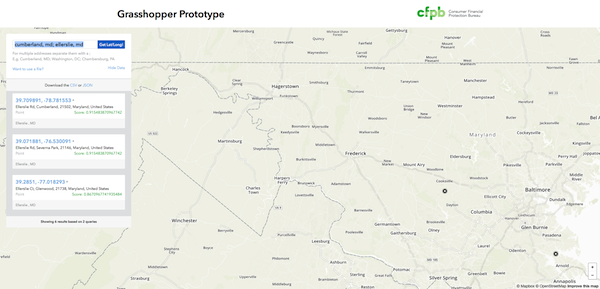

# Grasshopper-UI

This is the front-end for [Grasshopper](https://github.com/cfpb/grasshopper), CFPB's work-in-progress geocoder.
Expect to be able to geocode individual addresses as well as batches of addresses from files or piped in from other APIs.

Our working prototype can be found running in [gh-pages](http://cfpb.github.io/grasshopper-ui/dist/)



## Dependencies

### Front-end

- Node
- Grunt
- [Mapbox.js](https://www.mapbox.com/mapbox.js/api/v2.1.5/) (for now)

## Installation

### Grunt

First run

```shell
$ npm install
```

To view the site run

```
$ grunt
```

The site should now be live at `http://localhost:9001`.

*It uses [grunt-contrib-connect](https://www.npmjs.com/package/grunt-contrib-connect), [grunt-connect-proxy](https://www.npmjs.com/package/grunt-connect-proxy) to handle the API call, and [connect-livereload](https://www.npmjs.com/package/connect-livereload).*

### Docker

Follow the Docker instructions in the [grasshopper repo](https://github.com/cfpb/grasshopper#docker). 

**Note** - There is a dev setup for easier development.


## Known issues

We are still in the prototyping phase so there is a lot of ongoing work and errors could occur at anytime.

## Getting help

If you have questions, concerns, bug reports, etc, please file an issue in this repository's [Issue Tracker](https://github.com/cfpb/grasshopper-ui/issues).

## Getting involved

TBD

----

## Open source licensing info
1. [TERMS](TERMS.md)
2. [LICENSE](LICENSE)
3. [CFPB Source Code Policy](https://github.com/cfpb/source-code-policy/)
